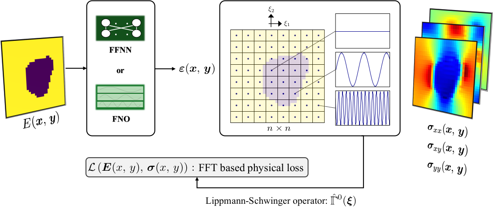

# SPiFOL
Spectral Physics-informed Finite Operator Learning
We employed operator learning and combined it with based approaches. 

what does that mean:
1) Instead of performing AD or trying to build equations by means of coordinates as input
   we use the Lippmann-Schwinger operator to build physical losses
2) Training time is in the same order as data-driven methodologies (even faster :)!)

For more information please check the following:
Harandi, Ali, et al. "A Spectral-based Physics-informed Finite Operator Learning for Prediction of Mechanical Behavior of Microstructures." arXiv preprint arXiv:2410.19027 (2024).

Citation: 
@article{harandi2024spectral,
  title={A Spectral-based Physics-informed Finite Operator Learning for Prediction of Mechanical Behavior of Microstructures},
  author={Harandi, Ali and Danesh, Hooman and Linka, Kevin and Reese, Stefanie and Rezaei, Shahed},
  journal={arXiv preprint arXiv:2410.19027},
  year={2024}
}  
